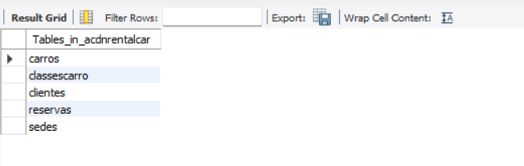
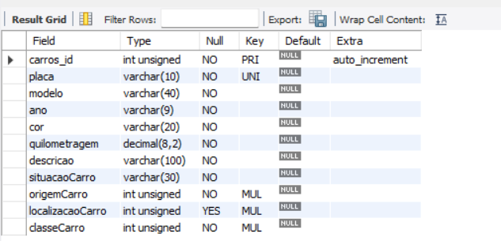
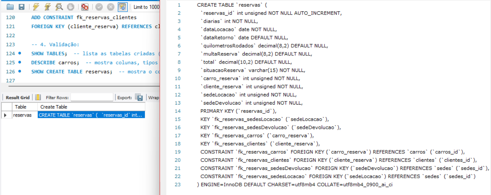

<div align="center">

# 🚗 ACDN Rental Car — Sistema de Reserva de Carros

**Script DDL em MySQL · MySQL DDL Script**


[Português (PT-BR)](#português-pt-br) · [English](#english)

</div>

---

# Português (PT-BR)

## Identificação

| Campo | Informação |
|---|---|
| **Estudante** | Piêtro Bitencourt Nunes |
| **Instituição** | Centro Universitário do Distrito Federal (UDF) |
| **Disciplina** | Modelagem de Banco de Dados |
| **Tipo de trabalho** | Individual |
| **SGBD** | MySQL |
| **Fonte** | Artigo "Modelando um Sistema de Reserva de Carros", SQL Magazine, edição 74 |

## Objetivo

Implementar em MySQL o banco de dados do **Sistema de Reserva de Carros** da locadora fictícia **ACDN Rental Car**, descrito no artigo da SQL Magazine (edição 74), criando o *database* e todas as tabelas do sistema usando **apenas comandos DDL** (`CREATE`, `ALTER`). A inserção de dados não faz parte do escopo.

## Sobre o sistema

A ACDN Rental Car permite que clientes reservem carros pela Internet ou diretamente na sede. A empresa possui duas sedes (matriz e filial), e a locação pode ser feita em uma sede e a devolução em outra, com cobrança de multa quando o carro não volta ao ponto de origem. Os carros são agrupados em classes (Subcompacto, Compacto, Tamanho Médio, Tamanho Grande e Luxo), e o valor da diária varia por classe.

## Estrutura do banco de dados

**Database:** `AcdnRentalCar`

| Tabela | Descrição | Colunas principais |
|---|---|---|
| `sedes` | Sedes da locadora (matriz e filial) | `sedes_id`, `nomeSede`, `enderecoSede`, `telefoneSede`, `nomeGerente`, `multaSede` |
| `classesCarro` | Classes de carro e valor da diária | `classesCarro_id`, `nomeClasse`, `valorDiaria` |
| `clientes` | Clientes cadastrados e dados da CNH | `clientes_id`, `nomeCliente`, `cpf`, `cnh`, `validadeCnh`, `categoriaCnh` |
| `carros` | Frota da locadora | `carros_id`, `placa`, `modelo`, `ano`, `cor`, `quilometragem`, `descricao`, `situacaoCarro`, `origemCarro`, `localizacaoCarro`, `classeCarro` |
| `reservas` | Locações realizadas | `reservas_id`, `diarias`, `dataLocacao`, `dataRetorno`, `quilometrosRodados`, `multaReserva`, `total`, `situacaoReserva`, `carro_reserva`, `cliente_reserva`, `sedeLocacao`, `sedeDevolucao` |

### Relacionamentos (7 chaves estrangeiras)

| Constraint | Tabela (lado "muitos") | Coluna | Referencia | Significado |
|---|---|---|---|---|
| `fk_carros_sedesOrigem` | `carros` | `origemCarro` | `sedes(sedes_id)` | Sede de origem do carro |
| `fk_carros_sedesLocAtual` | `carros` | `localizacaoCarro` | `sedes(sedes_id)` | Sede onde o carro está (pode ser nula) |
| `fk_carros_classes` | `carros` | `classeCarro` | `classesCarro(classesCarro_id)` | Classe do carro |
| `fk_reservas_sedesLocacao` | `reservas` | `sedeLocacao` | `sedes(sedes_id)` | Sede de retirada |
| `fk_reservas_sedesDevolucao` | `reservas` | `sedeDevolucao` | `sedes(sedes_id)` | Sede de devolução |
| `fk_reservas_carros` | `reservas` | `carro_reserva` | `carros(carros_id)` | Carro da reserva |
| `fk_reservas_clientes` | `reservas` | `cliente_reserva` | `clientes(clientes_id)` | Cliente da reserva |

## Decisões de modelagem

- **Estratégia de FKs:** as tabelas são criadas primeiro, sem relacionamentos, e as chaves estrangeiras são adicionadas depois com `ALTER TABLE`, como no artigo. Isso dispensa preocupação com a ordem de criação das tabelas.
- **Nomes de colunas:** PKs nomeadas como `tabela_id` (ex.: `sedes_id`) e colunas com sufixo da entidade (ex.: `nomeSede`, `situacaoCarro`) para evitar ambiguidade em consultas com `JOIN`.
- **`DECIMAL` em valores monetários:** exige precisão exata, ao contrário de `FLOAT`, que é aproximado.
- **`INT UNSIGNED` em PKs e FKs:** o tipo da FK precisa ser idêntico ao da PK referenciada.
- **`UNIQUE` em `cpf` e `placa`:** impede cadastros duplicados.
- **`localizacaoCarro` aceita `NULL`:** um carro alugado não está em nenhuma sede (multiplicidade `0..1` no modelo lógico).
- **Colunas opcionais em `reservas`:** `dataRetorno`, `quilometrosRodados`, `multaReserva` e `total` só são preenchidas na devolução do carro.
- **Duas FKs para `sedes` em `reservas` e em `carros`:** locação e devolução (ou origem e localização atual) são situações distintas e podem envolver sedes diferentes.

## Correções em relação ao código do artigo

O código publicado na revista contém erros que impedem sua execução ou o desviam do modelo lógico. Eles foram corrigidos nesta implementação:

| # | Problema no artigo | Correção aplicada |
|---|---|---|
| 1 | `endereco` declarado como `VARCHAR ... UNSIGNED` (modificador só vale para tipos numéricos) | `UNSIGNED` removido |
| 2 | Tabela `clientes` sem a coluna `cpf`, presente na Tabela 2 do artigo | Coluna `cpf` adicionada (com `UNIQUE`) |
| 3 | `localizacaoCarro` como `NOT NULL`, contradizendo a multiplicidade `0..1` | Coluna passou a aceitar `NULL` |
| 4 | Colunas de FK `INT` (com sinal) referenciando PKs `INT UNSIGNED` | Tipos igualados (`INT UNSIGNED`) |
| 5 | `` `id ` `` com espaço sobrando nas cláusulas `REFERENCES` | Nome correto da coluna referenciada |
| 6 | FK de `reservas` apontando para a tabela `cliente`, enquanto a criada se chama `clientes` | Nome da tabela corrigido |
| 7 | Sintaxe defasada `int(10)` e `float(8,2)` para valores monetários | `INT UNSIGNED` e `DECIMAL(p,s)` |

## Como executar

**Pré-requisito:** MySQL instalado (via MySQL Workbench, terminal ou outro cliente).

**Pelo terminal:**

```bash
mysql -u root -p < acdn_rental_car.sql
```

**Pelo MySQL Workbench:** abra o arquivo `acdn_rental_car.sql` e execute o script inteiro.

> 💡 Para recriar o banco do zero, execute antes `DROP DATABASE IF EXISTS AcdnRentalCar;`. Atenção: esse comando **apaga o banco inteiro**.

## Validação

Ao final do script, três comandos conferem o resultado:

```sql
SHOW TABLES;                  -- esperado: 5 tabelas
DESCRIBE carros;              -- colunas, tipos e se aceitam NULL
SHOW CREATE TABLE reservas;   -- comando de criação completo, incluindo as FKs
```

### Evidências

| Comando | Print |
|---|---|
| `SHOW TABLES;` |  |
| `DESCRIBE carros;` |  |
| `SHOW CREATE TABLE reservas;` |  |

## Regras de negócio fora do banco

Como no artigo, algumas regras não são implementadas no DDL e ficam a cargo da aplicação:

- Cliente com locação aberta não pode fazer segunda reserva.
- Só cliente com CNH válida pode reservar.
- Carro alugado ou fora do ponto de origem não pode ser devolvido sem regra de transferência.

## Estrutura da pasta

```text
02-reserva-carros-ddl/
├── acdn_rental_car.sql      # Script DDL completo e comentado
├── README.md                # Este arquivo
└── docs/
    └── screenshots/         # Evidências da execução
```

## Referência

NETO, Arilo Claudio Dias. **Modelando um Sistema de Reserva de Carros**. *SQL Magazine*, edição 74, p. 13–19.

---

# English

## Identification

| Field | Information |
|---|---|
| **Student** | Piêtro Bitencourt Nunes |
| **Institution** | Centro Universitário do Distrito Federal (UDF) |
| **Course** | Database Modeling (*Modelagem de Banco de Dados*) |
| **Type of work** | Individual |
| **DBMS** | MySQL |
| **Source** | Article "Modelando um Sistema de Reserva de Carros" (Modeling a Car Reservation System), SQL Magazine, issue 74 |

## Goal

Implement in MySQL the database of the **Car Reservation System** of the fictional rental company **ACDN Rental Car**, described in the SQL Magazine article (issue 74), by creating the database and every table of the system using **DDL statements only** (`CREATE`, `ALTER`). Data insertion is out of scope.

## About the system

ACDN Rental Car lets customers book cars online or at the company's office. The company has two branches (headquarters and a branch office); a car can be picked up at one branch and returned at the other, with a fee charged when the car is not returned to its home branch. Cars are grouped into classes (Subcompact, Compact, Mid-size, Full-size and Luxury), and the daily rate varies by class.

## Database structure

**Database:** `AcdnRentalCar`

| Table | Description | Main columns |
|---|---|---|
| `sedes` | Company branches | `sedes_id`, `nomeSede`, `enderecoSede`, `telefoneSede`, `nomeGerente`, `multaSede` |
| `classesCarro` | Car classes and daily rate | `classesCarro_id`, `nomeClasse`, `valorDiaria` |
| `clientes` | Registered customers and driver's license data | `clientes_id`, `nomeCliente`, `cpf`, `cnh`, `validadeCnh`, `categoriaCnh` |
| `carros` | Company fleet | `carros_id`, `placa`, `modelo`, `ano`, `cor`, `quilometragem`, `descricao`, `situacaoCarro`, `origemCarro`, `localizacaoCarro`, `classeCarro` |
| `reservas` | Rentals made | `reservas_id`, `diarias`, `dataLocacao`, `dataRetorno`, `quilometrosRodados`, `multaReserva`, `total`, `situacaoReserva`, `carro_reserva`, `cliente_reserva`, `sedeLocacao`, `sedeDevolucao` |

### Relationships (7 foreign keys)

| Constraint | Table ("many" side) | Column | References | Meaning |
|---|---|---|---|---|
| `fk_carros_sedesOrigem` | `carros` | `origemCarro` | `sedes(sedes_id)` | Car's home branch |
| `fk_carros_sedesLocAtual` | `carros` | `localizacaoCarro` | `sedes(sedes_id)` | Branch where the car currently is (nullable) |
| `fk_carros_classes` | `carros` | `classeCarro` | `classesCarro(classesCarro_id)` | Car class |
| `fk_reservas_sedesLocacao` | `reservas` | `sedeLocacao` | `sedes(sedes_id)` | Pick-up branch |
| `fk_reservas_sedesDevolucao` | `reservas` | `sedeDevolucao` | `sedes(sedes_id)` | Return branch |
| `fk_reservas_carros` | `reservas` | `carro_reserva` | `carros(carros_id)` | Reserved car |
| `fk_reservas_clientes` | `reservas` | `cliente_reserva` | `clientes(clientes_id)` | Customer who booked |

## Design decisions

- **FK strategy:** tables are created first without relationships, and foreign keys are added afterwards with `ALTER TABLE`, as in the article. This removes any concern about table creation order.
- **Column naming:** primary keys named `table_id` (e.g. `sedes_id`) and columns suffixed with the entity (e.g. `nomeSede`, `situacaoCarro`) to avoid ambiguity in `JOIN` queries.
- **`DECIMAL` for monetary values:** exact precision is required, unlike `FLOAT`, which is approximate.
- **`INT UNSIGNED` for PKs and FKs:** a foreign key must have exactly the same type as the primary key it references.
- **`UNIQUE` on `cpf` and `placa`:** prevents duplicate records.
- **`localizacaoCarro` is nullable:** a rented car is not at any branch (`0..1` multiplicity in the logical model).
- **Optional columns in `reservas`:** `dataRetorno`, `quilometrosRodados`, `multaReserva` and `total` are only filled in when the car is returned.
- **Two FKs to `sedes` in `reservas` and in `carros`:** pick-up and return (or home and current location) are distinct situations and may involve different branches.

## Fixes to the article's code

The code published in the magazine contains errors that prevent it from running or make it deviate from the logical model. They were fixed in this implementation:

| # | Problem in the article | Fix applied |
|---|---|---|
| 1 | `endereco` declared as `VARCHAR ... UNSIGNED` (the modifier only applies to numeric types) | `UNSIGNED` removed |
| 2 | `clientes` table missing the `cpf` column listed in the article's Table 2 | `cpf` column added (with `UNIQUE`) |
| 3 | `localizacaoCarro` declared `NOT NULL`, contradicting the `0..1` multiplicity | Column now accepts `NULL` |
| 4 | Signed `INT` FK columns referencing `INT UNSIGNED` primary keys | Types made identical (`INT UNSIGNED`) |
| 5 | `` `id ` `` with a trailing space in `REFERENCES` clauses | Correct referenced column name |
| 6 | FK in `reservas` pointing to table `cliente`, while the created table is `clientes` | Table name fixed |
| 7 | Outdated `int(10)` and `float(8,2)` syntax for monetary values | `INT UNSIGNED` and `DECIMAL(p,s)` |

## How to run

**Prerequisite:** MySQL installed (MySQL Workbench, command line or any other client).

**From the command line:**

```bash
mysql -u root -p < acdn_rental_car.sql
```

**From MySQL Workbench:** open `acdn_rental_car.sql` and run the whole script.

> 💡 To rebuild the database from scratch, first run `DROP DATABASE IF EXISTS AcdnRentalCar;`. Warning: this command **deletes the entire database**.

## Validation

At the end of the script, three commands check the result:

```sql
SHOW TABLES;                  -- expected: 5 tables
DESCRIBE carros;              -- columns, types and nullability
SHOW CREATE TABLE reservas;   -- full creation statement, including FKs
```

### Evidence

See the screenshots in the Portuguese section above (`docs/screenshots/`).

## Business rules outside the database

As in the article, some rules are not implemented in the DDL and are left to the application:

- A customer with an open rental cannot make a second reservation.
- Only customers with a valid driver's license can book.
- A rented car, or one outside its home branch, cannot be returned without a transfer rule.

## Folder structure

```text
02-reserva-carros-ddl/
├── acdn_rental_car.sql      # Complete, commented DDL script
├── README.md                # This file
└── docs/
    └── screenshots/         # Execution evidence
```

## Reference

NETO, Arilo Claudio Dias. **Modelando um Sistema de Reserva de Carros**. *SQL Magazine*, issue 74, pp. 13–19.
